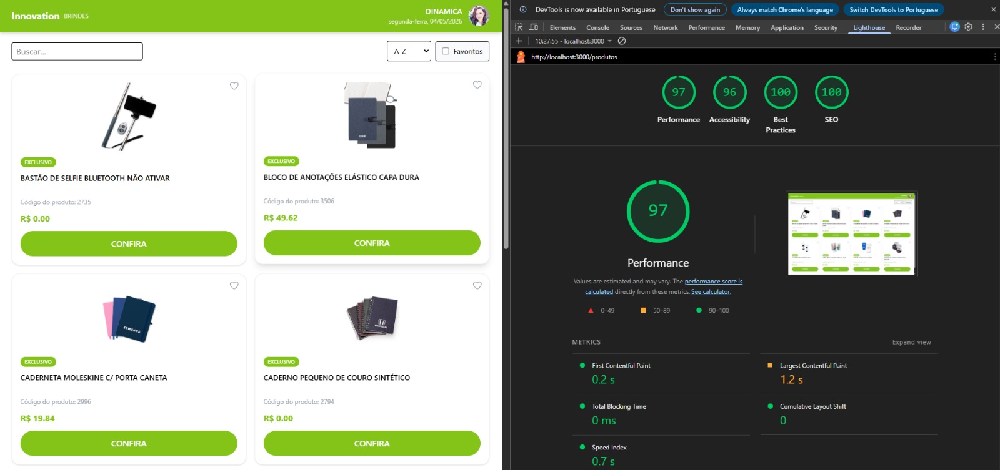

# 🚀 Inova App - Frontend (Next.js + Docker)

Este projeto é um frontend desenvolvido com Next.js e containerizado com Docker para facilitar a execução em qualquer ambiente. Ele utiliza Next.js, React e Docker.

## 📸 Preview do sistema

### Fluxo do sistema

### Lighhouse

---

# 🐳 Requisitos

- Docker Desktop
- Git

---

# ⚙️ Como executar o projeto

git clone git@github.com:Kevin-Amaral165/store-app.git  
cd inova-app  
docker build -t minha-app-next .  
docker run -p 3000:3000 minha-app-next  

---

# 🌐 Acesso

http://localhost:3000  

# 🧠 Docker neste projeto

O Docker é utilizado em duas etapas: a primeira realiza o build da aplicação Next.js instalando dependências e gerando os arquivos otimizados, e a segunda executa apenas o resultado final reduzindo tamanho da imagem e melhorando performance.

---

---

# ⚙️ Entregas pendentes

Criação de testes unitarios para os demais componentes obs: foi realizado apenas para o button.
Melhoria de tratamentos de estados refinado

---

---

# ⚙️ Implementações futuras

Implementações que gostaria de ter adicionado:

Ajuste do card para deixar dinamico, atualmente o Card está acoplado ao domínio de produtos.
Ajuste da paginação, gostaria de ter criado um componente de paginação reutilizável
Internacionalização (i18n), adicionar suporte a múltiplos idiomas

---

# 👨‍💻 Autor

Kevin Amaral